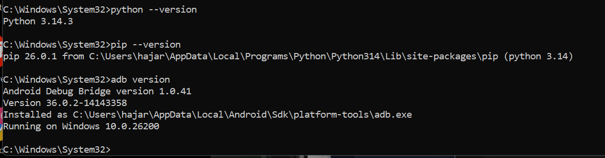
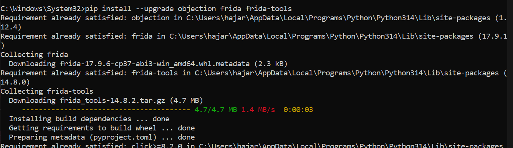
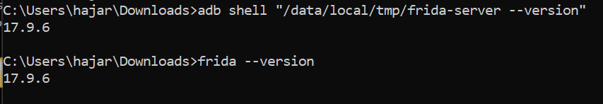
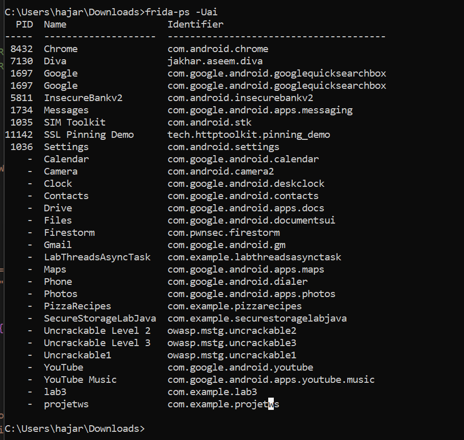
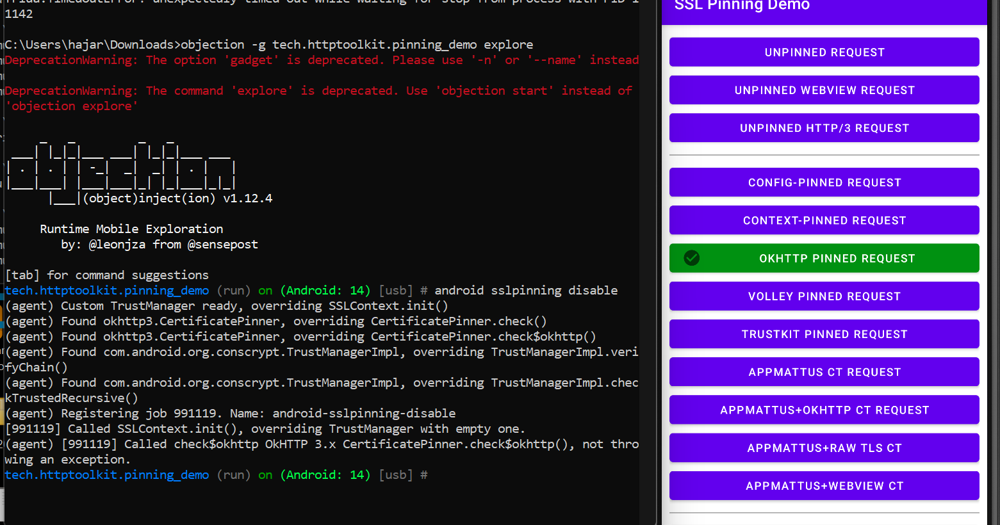
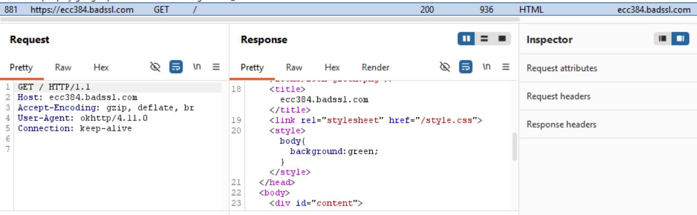

#  Bypass SSL Pinning via Objection

**Outils :** Objection (v1.12.4), Frida (v17.9.6), ADB, Burp Suite

---

## 1. Introduction : La Logique d'Objection
Dans le laboratoire précédent (Lab 15), nous avons utilisé Frida avec des scripts JavaScript personnalisés. Bien qu'efficace, cette méthode demande du temps et une connaissance approfondie des classes Java internes. **Objection** change la donne en agissant comme une surcouche ("wrapper") qui encapsule les meilleurs scripts de la communauté dans des commandes simples. 

L'intérêt d'Objection réside dans sa capacité à explorer le "Runtime" (la mémoire vive) d'une application de manière interactive, permettant de désactiver des protections complexes comme le SSL Pinning ou la détection Root en une seule ligne de commande.

---

## 2. Phase de Vérification des Prérequis

Avant de lancer une attaque, l'auditeur doit s'assurer de la stabilité de sa "Toolchain". Une version de Python obsolète ou un ADB mal configuré peut faire échouer l'injection.

> **Figure 1 :** Contrôle des versions Python (3.14), Pip (26.0) et ADB. Cette étape garantit que les outils de communication sont prêts.

---

## 3. Installation et Synchronisation des Versions

Le point le plus critique lors de l'utilisation de Frida/Objection est la synchronisation. Si la version de Frida sur le PC diffère de celle du serveur sur le téléphone, la connexion sera refusée ou instable.

> **Figure 2 :** Processus de mise à jour vers Frida 17.9.6. Objection s'appuie sur ces bibliothèques pour injecter son agent (`gadget`) dans l'application cible.

> **Figure 3 :** Validation du succès de la synchronisation. Les deux environnements (Hôte et Cible) affichent désormais la version 17.9.6.

---

## 4. Préparation de la Cible (Target Identification)

### 4.1 Pourquoi avoir choisi `SSL Pinning Demo` ?
Pour ce lab, nous avons conservé l'application **SSL Pinning Demo** (`tech.httptoolkit.pinning_demo`). Le choix est stratégique : elle nous permet de comparer directement l'efficacité de l'automatisation d'Objection par rapport au script manuel du Lab 15 sur les mêmes composants (OkHttp, TrustManager).

> **Figure 4 :** Utilisation de `frida-ps -Uai` pour identifier le nom de package exact. Cette étape est cruciale pour cibler le bon processus lors de l'injection.

---

## 5. Exécution de l'Attaque et Instrumentation

### 5.1 Lancement du Serveur Frida
Le serveur doit être lancé avec les droits `su` pour pouvoir monitorer les processus système et injecter du code dans l'application.

> **Figure 5 :** Initialisation du pont de communication entre le PC et l'Android Runtime (ART).

### 5.2 Exploration et Bypass SSL
L'injection se fait via la commande `explore`. Une fois à l'intérieur, Objection charge ses hooks universels.

> **Figure 6 :** Exécution de `android sslpinning disable`. On observe qu'Objection trouve automatiquement les classes `CertificatePinner` et `TrustManagerImpl` pour les neutraliser.

---

## 6. Validation des Résultats

Le succès de l'audit se mesure par la capacité à transformer un échec de connexion en un flux de données déchiffrées.

### 6.1 Confirmation sur l'interface mobile

> **Figure 7 :** Résultat final sur l'application. Le bouton **OKHTTP PINNED REQUEST** est vert, confirmant que le hook d'Objection a forcé la validation du certificat MITM.

### 6.2 Analyse du Flux Intercepté (Burp Suite)
Le succès technique est validé par la capture du trafic HTTPS en clair. Sans le bypass d'Objection, cet historique resterait vide à cause de la rupture du tunnel TLS.

> **Figure 8 :** Analyse de la requête interceptée vers `ecc384.badssl.com`.

**Points clés de l'interception :**
*   **Identification du Client** : Le header `User-Agent: okhttp/4.11.0` confirme que c'est bien notre application cible qui communique.
*   **Déchiffrement Réussi** : Nous visualisons le contenu HTML de la réponse (`<title>ecc384.badssl.com</title>`) et le style CSS associé. Cela prouve que le proxy Burp Suite a pu se substituer au serveur réel grâce à la neutralisation de la vérification de certificat opérée par Objection.
*   **Intégrité des Données** : La réponse `200 OK` montre que la communication n'est pas seulement interceptée, mais qu'elle reste fonctionnelle pour l'utilisateur final.

---

## 7. Conclusion
Le Lab 16 démontre la puissance de l'automatisation. Là où le Lab 15 demandait une analyse ligne par ligne, Objection a permis d'obtenir le même résultat en quelques secondes. C'est l'outil indispensable pour tout auditeur de sécurité mobile cherchant à gagner en efficacité lors d'un test d'intrusion.

---

